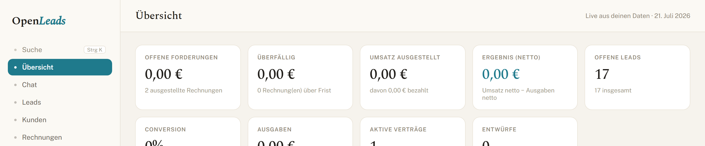
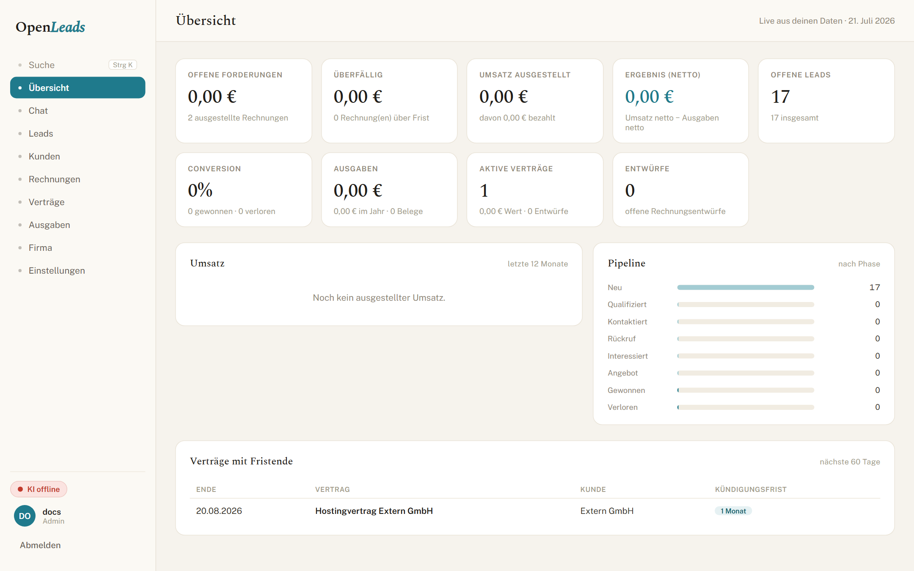
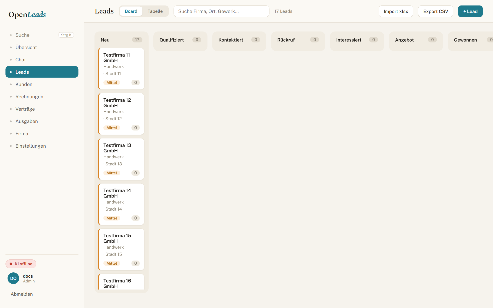
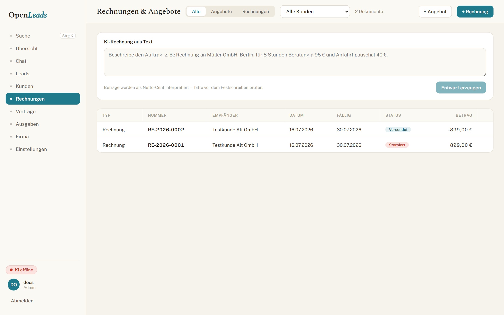

<p align="center">
  
</p>

# OpenLeads
### Self-hosted sales and billing for web agencies — from lead to German e-invoice.

---

## A quick look

#### Übersicht


#### Lead pipeline


#### Rechnungen & Angebote


---

## Overview

OpenLeads is a small, self-hosted suite for people who sell **websites**, **Hosting & Pflege**, and **local online marketing** to small businesses. It covers the path from “this shop still has a 2016 WordPress site” to a proper **ZUGFeRD / Factur-X** invoice — and the AI can actually *drive* the product, not just sit in a chat box on the side.

It runs on open models you host yourself (local [Ollama](https://ollama.com) by default). Customer data does not need to leave your machine.

### What you get

- **Übersicht** — live KPIs: open and overdue amounts, paid totals, a 12-month revenue chart, pipeline by stage, active contracts, and a reminder list for contracts ending within 60 days
- **Chat (KI)** — a copilot that uses the same audited tools as the UI: qualify leads, move stages, draft outreach, build invoices, manage catalog and customers, draft contracts. Point it at a URL and it can create a qualified lead
- **Leads** — CRM pipeline (kanban + table), stages, tags, notes; website-state fields (mobile-friendly?, tech, staleness, score). Import via `.xlsx`, manual entry, or Chat. Dedupe by domain
- **Kunden** — central client registry; prefills recipient data into invoices, contracts, and series
- **Rechnungen** — Angebote and Rechnungen with line items and print-ready PDF. Finalised invoices are ZUGFeRD / Factur-X (PDF/A-3 + EN 16931 XML), §19 UStG aware, gapless numbering. Payments (partial OK), Stornorechnung for corrections. Issued documents are immutable (GoBD)
- **Serienrechnungen** — recurring drafts for Hosting-/Wartungsverträge (monthly / quarterly / yearly). Nothing auto-sends
- **Verträge** — Dienst-, Werk-, Wartungsvertrag, Auftragsbestätigung, Rahmenvertrag, AVV… AGB frozen at finalise. Or skip the builder and **PDF ablegen** for existing contracts
- **Ausgaben** — receipts with SKR03 categories, net + Vorsteuer split, DATEV export, plus your own SaaS/hosting Abos with renewal reminders
- **Einstellungen** — business profile, numbering, AGB, Leistungskatalog (prefilled for a web agency), users, AI + SMTP, Steuerberater exports, backup, DSGVO toolkit

Cross-module jumps leave a **„Zurück zu …“** trail (browser back works too). **Strg/Cmd+K** opens global search. The UI is German; the app is installable as a PWA.

> **Note:** The AI never sends mail on its own. A human approves every outgoing message.

---

## Stack

Deliberately light: Node’s built-in SQLite, a small Hono API, Vite/React, pure-JS PDFs.

| Part | Tech |
|------|------|
| `api/` | [Hono](https://hono.dev) + Node `node:sqlite` |
| `web/` | React 19 + Vite (vanilla CSS, “Kanzlei” theme) |
| AI | OpenAI-compatible `fetch` → Ollama / vLLM, open models |
| PDF | `pdfkit` → PDF/A-3 + Factur-X |
| Auth | scrypt + server-side DB sessions |

```
api/src/
  index.ts        # composition root
  routes/         # one HTTP module per domain
  ai/             # provider, agent loop, tools, prompts
  <domain>.ts     # domain logic + SQL
  <domain>.test.ts
```

---

## Getting started

Needs **Node 22.5+** (for `node:sqlite`); Node 24 recommended.

```bash
# 1) API  → http://127.0.0.1:8787
cd api
npm install
cp .env.example .env          # set SETTINGS_KEY (see below)
npm run seed -- <user> <pw>   # create the login (no public signup)
npm run dev

# 2) Web  → http://localhost:5173  (proxies /api to the API)
cd ../web
npm install
npm run dev
```

Open **http://localhost:5173** and sign in. A fresh database already has a starter **Leistungskatalog** (Website-Pakete, Relaunch, Hosting & Pflege, SEO, …).

`node:sqlite` prints an `ExperimentalWarning` on boot — expected, ignore it.

If you use Claude Code, ask it to *“set up OpenLeads”* (skill `setup-openleads`) — same steps, driven for you.

### Configuration

| Variable | Where | Purpose |
|----------|-------|---------|
| `SETTINGS_KEY` | api | Encrypts credentials saved in Settings (required in production) |
| `DB_PATH` | api | SQLite path (default `./data/leads.db`) |
| `WEB_ORIGIN` | api | Allowed browser origin (CORS + CSRF) |
| `TRUST_PROXY` | api | Set `1` only behind *your* reverse proxy |
| `AI_*` | api / UI | AI endpoint (default: local Ollama) |
| `SMTP_*` | api / UI | Outgoing mail (optional) |

Generate a key:

```bash
node -e "console.log(require('crypto').randomBytes(32).toString('hex'))"
```

There is no session secret: sessions live in the database, so logout and password resets revoke them for real.

---

## Documentation

| Doc | What it covers |
|-----|----------------|
| [docs/SETUP.md](docs/SETUP.md) | Dev setup, AI, common pitfalls |
| [docs/MODULES.md](docs/MODULES.md) | Tour of every module (with screenshots) |
| [docs/USAGE.md](docs/USAGE.md) | Day-to-day workflow, shortcuts, imports |
| [docs/AI.md](docs/AI.md) | Copilot, tools, human-in-the-loop |
| [docs/COMPLIANCE.md](docs/COMPLIANCE.md) | ZUGFeRD, GoBD, DSGVO notes |
| [docs/templates/](docs/templates/) | Lead import spreadsheet templates |
| [deploy/DEPLOY.md](deploy/DEPLOY.md) | Docker Compose + nginx production |

---

## Deployment

One Docker image holds the built web app and the API. The SQLite DB sits in a named volume so it survives image updates. Walkthrough: **[deploy/DEPLOY.md](deploy/DEPLOY.md)**.

---

## e-Invoices (ZUGFeRD / Factur-X)

A finalised Rechnung embeds EN 16931 Cross Industry Invoice XML (`factur-x.xml`) into a PDF/A-3, so lexoffice / sevDesk / DATEV can pick up line items on their own. Kleinunternehmer invoices use tax category `E` (§19); otherwise category `S` at your configured rate.

> Validate output with the official ZUGFeRD validator / Mustang / veraPDF before relying on it for tax purposes. Target profile: EN 16931.

---

## License

[MIT](LICENSE) — © 2026 Lucas Reimers.

## Disclaimer

OpenLeads is provided as-is. It is **not** tax or legal advice — check invoice output and your bookkeeping obligations with your Steuerberater.
