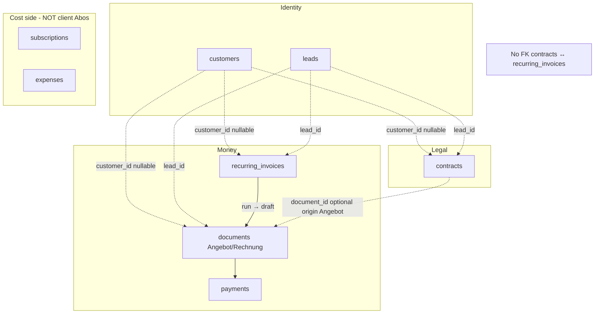
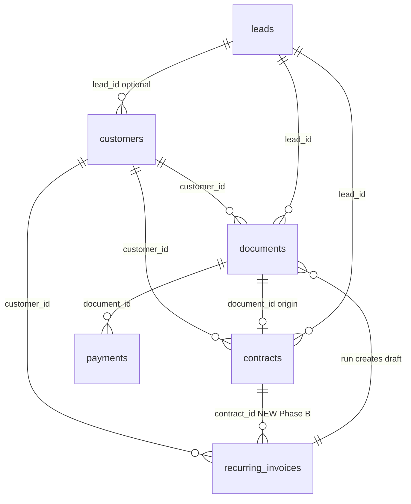
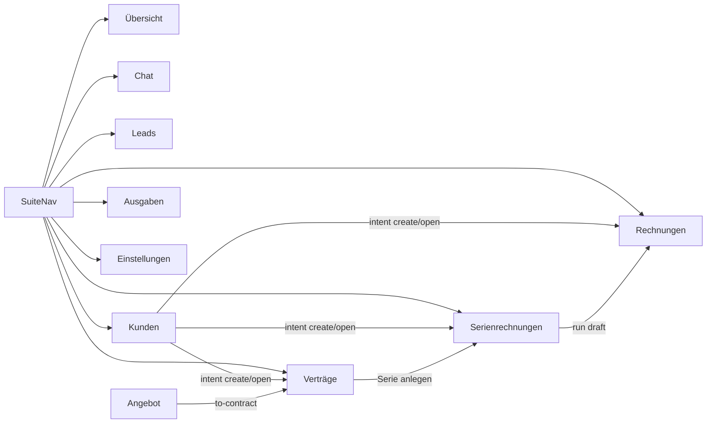
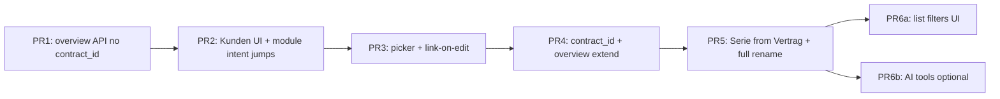

# OpenLeads: Kunde-centric Vertrag + Abo restructure

| Field | Value |
|-------|--------|
| **Author** | OpenLeads design (isarwebsites) |
| **Date** | 2026-07-15 |
| **Status** | Implemented (Phase A+B) |
| **Scope** | Phase A (Kunden hub) + Phase B (Vertrag ↔ Serie) + optional Phase C sketch |
| **Codebase** | `D:\Repos\openleads` (Hono + SQLite API, React web) |

---

## Overview

OpenLeads already has the building blocks for client billing — **Kunden** (registry + `customer_id` FKs), **Verträge** (legal paper, AGB freeze, signed PDF), **Serienrechnungen** / recurring templates (cadence → draft Rechnung), and **Dokumente** (Angebot/Rechnung with ZUGFeRD and payments) — but they are fragmented in the product surface. The Kunden **UI tab and overview were removed** in the streamline pass; create paths retype free-text `client_*` snapshots; and there is **no link between `contracts` and `recurring_invoices`**. Naming also collides: nav label **„Abo-Rechnungen“** vs cost-side **„Laufende Abos“** under Ausgaben.

This design re-centres the product model on **Kunde → Vertrag → (optional) Serie → Rechnung**, **restores the prior Kunden overview** (same modest cockpit that was deleted: KPI cards + linked tables) **with list caps and a signed-doc flag**, adds **`recurring_invoices.contract_id`**, and renames client-side recurring billing to **„Serienrechnungen“** to distinguish it from outgoing subscriptions. Signed contract PDF upload **already exists** and must be preserved and surfaced on the Kunde overview.

Work is phased (A → B → C), schema changes are **additive only**, and the live DB is nearly empty of billing rows (~17 leads, 0 contracts/docs/customers) — a low-risk migration window. Scale target remains single-tenant isarwebsites (not multi-tenant).

---

## Background & Motivation

### Current architecture (as implemented)



| Layer | Code | Role today |
|-------|------|------------|
| **Kunden** | `api/src/customers.ts`, `api/src/routes/customers.ts`, `customers` table in `db.ts` | Full CRUD API; prefill on create for docs/contracts/recurring; AI tools `list_customers` / `create_customer`. **No web UI** (tab + `CustomersView` removed). Overview helper + `GET /api/customers/:id/overview` removed in streamline. |
| **Verträge** | `api/src/contracts.ts`, `routes/contracts.ts`, `web/.../ContractsView.tsx` | Types (`werkvertrag`, `wartungsvertrag`, …), gapless number, AGB freeze, sign, PDF, **signed-doc BLOB**. Optional `customer_id`, `document_id`. List API already returns `has_signed_doc`; **list UI does not show a badge** (only the editor section). |
| **Serien** | `api/src/recurring.ts`, `routes/recurring.ts`, `RecurringView.tsx` | Template + cadence → draft Rechnung (`runRecurring` / scheduler). Optional `customer_id`. Nav still **„Abo-Rechnungen“**. Many user-facing strings still say „Abo“. |
| **Rechnungen** | `api/src/documents.ts`, payments, Factur-X | `client_*` value snapshots; `customer_id` on create; signed/final copy store. |
| **Ausgaben Abos** | `api/src/subscriptions.ts`, `SubscriptionsView.tsx` | **Outgoing** SaaS/hosting costs — different domain, same colloquial „Abo“. |

### Pain points

1. **No Kunde hub in UI** — operators cannot maintain clients once and jump to linked papers; identity is retyped as `client_name` / address on every create path.
2. **Vertrag and Serie are peers, not parent/child** — a Hosting/Pflege Wartungsvertrag has no first-class billing plan; operators keep two unlinked records.
3. **Naming confusion** — „Abo-Rechnungen“ (revenue) vs „Laufende Abos“ (expense subscriptions); RecurringView body copy still uses „Abo“ throughout.
4. **Overview removed entirely** — the prior Customer overview (KPIs + jump tables) was deleted with streamline; operators need that cockpit back, with signed-copy visibility.
5. **`customer_id` is create-only in practice** — not on `EDITABLE_COLS` for contracts/recurring; documents PATCH has no `customer_id`; web create bodies often omit it; web `api.ts` has **no customers client methods**.

### What already works (preserve)

**Signed contract PDF (do not redesign):**

| Piece | Location |
|-------|----------|
| Schema | `contracts.signed_doc_data/name/mime/size` (BLOB, migration in `db.ts`) |
| Domain | `setSignedDoc` / `getSignedDoc` / `deleteSignedDoc` in `contracts.ts` |
| Routes | `POST/GET/DELETE /api/contracts/:id/signed-document` |
| Serialisation | List/get use `COLS_NO_BLOB` + `has_signed_doc`; bytes never in JSON |
| UI | **„Unterschriebenes Dokument“** in `ContractsView.tsx` editor only |
| Same pattern | `documents.signed_doc_*` + „Gespeichertes Dokument“ |
| Backup | Inline BLOBs ride in `VACUUM INTO` snapshots (`backup.ts`) |

Same in-the-loop rules stay: drafts only from scheduler; human finalises/sends; gapless numbering; `client_*` value snapshots so customer renames never rewrite issued papers.

### Prefill precedence today (accurate)

| Create path | Precedence | Notes |
|-------------|------------|--------|
| Document (`POST /api/documents`) | **explicit > customer > lead** | Lead fills only remaining nulls for company/city/email |
| Contract (`createContract`) | **explicit > customer > lead** | Same pattern |
| Recurring (`createRecurring`) | **explicit > customer only** | Sets `lead_id` from customer when present; **does not** prefill address/name from the lead row. Phase B may optionally add lead fill — see B.2 |

Invalid `customer_id` on create is **silently treated as no customer** today (`getCustomer` → null → `customer_id: null`). This design **changes that** for new/updated link fields: unknown FK → **400** with German error (see A.3).

---

## Goals & Non-Goals

### Goals

1. **Phase A** — Restore **Kunden** nav tab + list/CRUD + **prior overview** (KPI cards + linked tables, list-capped); customer picker on create; **link-on-edit for `customer_id` required** (PR 3); German labels.
2. **Phase B** — Add nullable `recurring_invoices.contract_id` FK; create Serie from Vertrag (prefill client + commercial fields); list filters by customer / contract; **full** rename of revenue-side UI strings **Abo → Serienrechnung(en)**.
3. **Surface signed-doc presence** on Kunde overview and **contract list rows** (flag already on API; **UI-only** list badge — no new endpoints).
4. **Additive schema only**; backup-first deploy notes; rollback by feature ignore / nullable columns left in place.
5. Keep AI tools aligned (`customer_id`); Phase B optional trailing: `list_recurring` / `create_recurring` with `contract_id`.

### Non-Goals

- Expanding the overview beyond the **removed** cockpit + signed-doc flag + list caps (no multi-contact companies, activity timeline, revenue charts, or heavy analytics). Framing: **restore prior overview**, not invent a smaller product.
- Auto-send / auto-finalise of invoices or contracts.
- Merging expense `subscriptions` with client Serien (different tables; clarify labels only).
- Contacts/companies split (roadmap open item).
- Dropping free-text `client_*` in favour of live joins (snapshots stay for GoBD immutability).
- Replacing signed-doc storage or PDF pipeline.
- Phase C close-flow automation as required work (optional later sketch only).
- Multi-tenant or per-user customer scoping.
- Claiming DSGVO Art. 15/17 completeness for the Kunden registry (lead-centric tools only today — follow-up, not A/B).

---

## Proposed Design

### Product model

```
KUNDE (hub — who)
  └─ VERTRAG (legal + commercial truth — what we agreed)
        types: Werk | Dienst | Wartung/Abo | Rahmen | AVV | …
        optional signed PDF (existing)
        └─ if recurring: SERIE / BILLING PLAN (how we invoice)
              cadence → draft RECHNUNGEN (money events)
```

| Concept | German UI | Table / module | Principle |
|---------|-----------|----------------|-----------|
| Who | **Kunde** | `customers` | Maintained once; links are convenience |
| What we agreed | **Vertrag** | `contracts` | Legal + commercial truth; AGB freeze; signed copy |
| How we invoice | **Serienrechnung** (pl. **Serienrechnungen**) | `recurring_invoices` | Template + cadence; never auto-finalise |
| Money event | **Rechnung** | `documents` (kind=`rechnung`) | Numbered, ZUGFeRD, payments |
| Cost Abo | **Laufende Abos** (under Ausgaben) | `subscriptions` | Outgoing — unchanged |

**Decided label:** nav and page title = **„Serienrechnungen“** (not „Abo-Fakturierung“). Singular in copy: **„Serienrechnung“** / short **„Serie“** where space is tight (buttons).

### Target relationship diagram



### Phase A — Kunden hub + picker

#### A.1 Backend: restore overview (prior cockpit + caps + signed flag)

Reintroduce `customerOverview(id)` in `api/src/customers.ts` and `GET /api/customers/:id/overview` on `routes/customers.ts`.

**Framing:** This is a **restore of the removed Customer overview** (PROGRESS: documents with gross/paid/open, contracts, recurring, revenue KPIs, three KPI cards + jump tables), plus:

- `has_signed_doc` on document/contract list rows in the overview  
- **List caps** (`LIMIT 20`) so large histories do not dump unbounded arrays  
- No expansion beyond that (no activity feed, charts, multi-contact)

Do **not** claim a large scope cut vs the deleted code; the deleted feature was already a modest cockpit.

##### KPI definitions (exact)

| KPI | Definition |
|-----|------------|
| `invoices_count` | `documents` where `customer_id = ? AND kind = 'rechnung' AND number IS NOT NULL AND status != 'storniert'` |
| `invoiced_gross_cents` | Sum of **gross** (line-item net + VAT, same as `computeTotals`) over those invoices |
| `paid_cents` | `SUM(payments.amount_cents)` for payments whose `document_id` is in that invoice set |
| `open_cents` | `SUM(max(0, gross_cents − paid_cents))` over the same invoice set (per-invoice, then sum) |
| `quotes_count` | `documents` where `customer_id = ? AND kind = 'angebot'` — **all statuses including drafts** (pipeline visibility) |
| `contracts_active` | `contracts` where `customer_id = ? AND status = 'aktiv'` only (not `versendet`) |
| `contracts_total` | all `contracts` with `customer_id = ?` (any status) |
| `series_active` | `recurring_invoices` where `customer_id = ? AND active = 1` |

##### Aggregates vs lists (correctness)

KPIs **must not** be derived from capped list windows. Use **separate unbounded aggregate queries** (or full-set helpers with no LIMIT) for KPIs; use **LIMIT 20** only for table payloads.

**Phase A response shape** — **no `contract_id` / `contract_number`** (column does not exist until Phase B / PR 4):

```ts
interface CustomerOverview {
  customer: CustomerRow
  kpis: {
    invoices_count: number
    invoiced_gross_cents: number
    paid_cents: number
    open_cents: number
    quotes_count: number
    contracts_active: number
    contracts_total: number
    series_active: number
  }
  documents: Array<{
    id: number; kind: string; number: string | null; status: string
    title: string | null; issue_date: string | null
    gross_cents: number; paid_cents: number; open_cents: number
    has_signed_doc: boolean
  }>  // newest first, LIMIT 20
  contracts: Array<{
    id: number; number: string | null; type: string; status: string
    title: string | null; value_cents: number
    start_date: string | null; end_date: string | null
    has_signed_doc: boolean
    signed_doc_name?: string | null
  }>  // newest first, LIMIT 20
  recurring: Array<{
    id: number; title: string | null; cadence: string
    next_run: string; active: number
    // Phase A only — no contract_id field
  }>  // active first, then next_run; LIMIT 20
}
```

**PR 1 must not reference `contract_id`** in SQL, TypeScript shapes, or tests. PR 4 extends the recurring array entries with `contract_id` + optional `contract_number` (LEFT JOIN `contracts`).

##### Aggregate SQL (KPIs — no LIMIT)

```sql
-- Invoice set filter reused conceptually:
-- kind = 'rechnung' AND number IS NOT NULL AND status != 'storniert' AND customer_id = ?

-- counts
SELECT COUNT(*) FROM documents
 WHERE customer_id = ? AND kind = 'rechnung'
   AND number IS NOT NULL AND status != 'storniert';

SELECT COUNT(*) FROM documents
 WHERE customer_id = ? AND kind = 'angebot';

SELECT COUNT(*) FROM contracts WHERE customer_id = ? AND status = 'aktiv';
SELECT COUNT(*) FROM contracts WHERE customer_id = ?;
SELECT COUNT(*) FROM recurring_invoices WHERE customer_id = ? AND active = 1;
```

**Gross / paid / open:** Prefer the same bulk pattern as `listDocuments` (explicit columns, no BLOB), restricted by `customer_id` and invoice filters, then in process:

1. Load all matching invoice ids for the customer (unbounded — fine for agency scale; if ever huge, SQL SUM via `document_items` + payments subquery).  
2. Bucket line items → `computeTotals` per doc → gross.  
3. Bucket `SUM(amount_cents)` from `payments` by `document_id`.  
4. `open_cents = sum(max(0, gross − paid))`.

Do **not** use only the LIMIT 20 list for these sums.

##### List SQL (tables — LIMIT 20; Phase A)

```sql
-- documents (list window only)
SELECT id, kind, number, status, title, issue_date, customer_id,
       (signed_doc_data IS NOT NULL) AS has_signed_doc
FROM documents WHERE customer_id = ?
ORDER BY created_at DESC, id DESC LIMIT 20;

-- contracts (list window only)
SELECT id, number, type, status, title, value_cents, start_date, end_date,
       signed_doc_name,
       (signed_doc_data IS NOT NULL) AS has_signed_doc
FROM contracts WHERE customer_id = ?
ORDER BY created_at DESC, id DESC LIMIT 20;

-- recurring (Phase A: existing columns only — NO contract_id)
SELECT id, title, cadence, next_run, active
FROM recurring_invoices WHERE customer_id = ?
ORDER BY active DESC, next_run, id LIMIT 20;
```

For each listed document, attach `gross_cents` / `paid_cents` / `open_cents` via bulk items + payments for **those ids only** (not for KPI totals).

**Tests (new — former overview tests are gone from the tree):** write fresh tests in `customers.test.ts`:

- KPI aggregation with partial payment (gross/paid/open correct; not limited by list window — seed >20 invoices if practical, or assert aggregates use a path independent of list length)  
- `quotes_count` includes draft Angebote  
- `contracts_active` counts only `status = 'aktiv'`  
- Missing customer → null / route 404  
- `has_signed_doc` true when BLOB set; response never includes raw bytes  

#### A.2 Web: Kunden module

| File | Change |
|------|--------|
| `web/src/components/SuiteNav.tsx` | Add module `'customers'`, label **„Kunden“** (after Leads, before Rechnungen). |
| `web/src/App.tsx` | Render `CustomersView`; hold **module intent** state (see A.4); pass handlers into views. |
| `web/src/components/customers/CustomersView.tsx` | **New**: list (active filter, search name/city/email), create/edit form, overview panel. |
| `web/src/api.ts` | `listCustomers`, `getCustomer`, `createCustomer`, `updateCustomer`, `deleteCustomer`, `customerOverview`. |
| `web/src/types.ts` | `Customer`, `CustomerOverview` (Phase A shape without `contract_id`). |

**Overview UI:**

- KPI chips: fakturiert (gross) / bezahlt / offen / aktive Verträge (and optionally quotes/series counts as secondary text)  
- Tables: Dokumente | Verträge | Serien with **Öffnen** → App intent `{ module, openId }`  
- Contracts: badge **„Unterschrift liegt vor“** when `has_signed_doc`  
- Quick actions (see A.4): create-with-customer intents  

Match existing list/editor chrome (`content`, `page-title`, table + side editor).

**PR 2 deliverable honesty:** PR 2 ships CRUD + overview display + wires jump/create **through App intent**. It **depends on** the prop hooks on `InvoicesView` / `ContractsView` / `RecurringView` defined in A.4 — implement those open-by-id / create-consume hooks in the **same PR 2** (minimal: open existing + create-and-open). PR 3 adds the **picker inside editors** and link-on-edit; not required for overview jumps.

#### A.3 Customer picker + link-on-edit (required in Phase A / PR 3)

Shared component `web/src/components/CustomerPicker.tsx`:

- Loads `GET /api/customers?active=1`  
- Combobox / select: name + city  
- On select: set `customer_id` and prefill local draft fields (name, address, zip, city, email, client_type; `client_vat_id` only on documents)  
- Explicit field edits after prefill stay; do **not** clear `customer_id` when user edits name  

Wire into `DocumentEditor` / new-doc path, `ContractsView`, `RecurringView`.

##### PATCH / link-on-edit rules (required — no vague helper)

**Do not introduce `applyCustomerPrefill` as a separate public API.** Two code paths only:

| Path | When | Behaviour |
|------|------|-----------|
| **Create prefill** | `POST` with `customer_id` | Existing: resolve customer; fill nullish client fields from customer (and lead for docs/contracts); store link. **Unknown `customer_id` → 400** `Kunde nicht gefunden.` (change from silent null). |
| **Edit link-only** | `PATCH` with `customer_id` | Update **only** the `customer_id` column. **Never** auto-copy `client_*` from the customer on PATCH. Unknown id → 400. Setting `null` unlinks. |

Optional future (out of A/B scope unless product asks): body flag `overwrite_snapshot: true` **only if** row is still a draft (`documents.number IS NULL` / `contracts.number IS NULL`; recurring always editable) — would re-copy client fields. **Not implemented in A/B** unless a later PR needs it; default remains link-only forever on PATCH.

**Backend edits (PR 3):**

- Add `customer_id` to `EDITABLE_COLS` in `contracts.ts` and `recurring.ts`  
- Add `customer_id` to document PATCH editable keys in `routes/documents.ts` (today `DOC_EDITABLE` has no `customer_id`)  
- Validate FK existence on create and PATCH when non-null  

**UI note:** Finalised docs/contracts lock client fields in the UI when `number` is set; API may still accept client field PATCH today — **do not** use PATCH link-on-edit as a back door to rewrite snapshots. Snapshots change only when the client explicitly PATCHes `client_*` (existing behaviour) or on create prefill.

**Create prefill precedence (unchanged accuracy):**

- Documents / contracts: **explicit > customer > lead**  
- Recurring: **explicit > customer** (lead address fill not in tree today; optional B.2)

#### A.4 Module intent: deep-link + quick-create (implementation contract)

App has **no client router**. Extend the existing `invoiceLead` pattern into a single **module intent** union. Views own create vs open as specified below.

```ts
// web/src/App.tsx (conceptual)
type ModuleIntent =
  | { type: 'open'; module: 'documents' | 'contracts' | 'recurring'; openId: number }
  | {
      type: 'create'
      module: 'documents'
      kind: 'angebot' | 'rechnung'
      customer_id: number
    }
  | { type: 'create'; module: 'contracts'; customer_id: number }
  | { type: 'create'; module: 'recurring'; customer_id: number }
  | null

// App holds:
// const [intent, setIntent] = useState<ModuleIntent>(null)
// setModule(intent.module) when intent is set
```

| Intent | Who POSTs | Target view props | Consume |
|--------|-----------|-------------------|---------|
| `open` documents | — | `InvoicesView`: `initialOpenId?: number`, `onInitialOpenConsumed` | Set `openId`, clear intent |
| `open` contracts | — | `ContractsView`: `initialOpenId?: number`, `onConsumed` | Load contract into `draft` via `api.getContract`, clear intent |
| `open` recurring | — | `RecurringView`: `initialOpenId?: number`, `onConsumed` | Load into `draft` via `api` get/list, clear intent |
| `create` documents | **InvoicesView** on mount when `createIntent` present | `createIntent?: { kind; customer_id }`, `onCreateConsumed` | `api.createDocument({ kind, customer_id })` → open editor; clear |
| `create` contracts | **ContractsView** | `createIntent?: { customer_id }`, `onCreateConsumed` | `api.createContract({ customer_id })` → set draft; clear |
| `create` recurring | **RecurringView** | `createIntent?: { customer_id }`, `onCreateConsumed` | `api.createRecurring({ customer_id })` → set draft; clear |

**Kunden overview / quick actions** only call `setModule` + `setIntent` — they do **not** POST themselves (avoids double-create and keeps API calls next to the module that already owns list refresh).

**Existing lead path:** keep `invoiceLead` or fold into `create` intent with `lead_id` instead of `customer_id` (implementation choice; either is fine if documented in PR). Prefer folding into the same intent union with optional `lead_id` for one plumbing path:

```ts
| { type: 'create'; module: 'documents'; kind: 'angebot' | 'rechnung'; customer_id?: number; lead_id?: number }
```

**PR split:**

| PR | Intent responsibility |
|----|----------------------|
| **PR 2** | Add `initialOpenId` + create intents for all three views; Kunden overview jumps + quick-create work end-to-end |
| **PR 3** | CustomerPicker inside editors; PATCH `customer_id`; save picker on existing drafts |

#### A.5 AI (Phase A)

Already: `list_customers`, `create_customer`, create doc/contract with `customer_id`.  
Prompt already nudges lookup-first (`api/src/ai/prompts.ts`). No mandatory AI change in A. Overview remains human-UI only.

---

### Phase B — Vertrag ↔ Serie

#### B.1 Schema migration (additive)

In `api/src/db.ts`, after existing customer_id migrations:

```ts
// Link a Serienrechnung (billing plan) to the Vertrag it invoices.
try {
  db.exec(
    'ALTER TABLE recurring_invoices ADD COLUMN contract_id INTEGER REFERENCES contracts(id) ON DELETE SET NULL',
  )
} catch {
  // column already exists
}
try {
  db.exec('CREATE INDEX IF NOT EXISTS idx_recurring_contract ON recurring_invoices(contract_id)')
} catch {
  // ignore
}
```

| Property | Choice | Rationale |
|----------|--------|-----------|
| Nullable | Yes | Existing/orphan series remain valid |
| ON DELETE | SET NULL | Deleting a **draft** contract must not delete billing templates; finalised contracts cannot be deleted (`deleteContract` → `finalised`) |
| Cardinality | **1 Vertrag → N Serien, freely** | Hosting + Pflege as two templates; **no warning** if a second active series exists (Key Decision) |
| Reverse required | No | Serie may exist without Vertrag |

#### B.2 Domain API — full touch list

Every site that must learn `contract_id` in PR 4:

| Touch point | Change |
|-------------|--------|
| `db.ts` | ALTER + index; `RecurringInvoiceRow.contract_id` |
| `recurring.ts` `RecurringInput` | `contract_id?: number \| null` |
| `createRecurring` **INSERT column list** | Add `contract_id` (explicit INSERT — not SELECT *) |
| `EDITABLE_COLS` | Include `contract_id` |
| `updateRecurring` | Validate FK when non-null; unknown → throw German error |
| `listRecurring(filters?)` | Signature: `listRecurring(opts?: { customer_id?: number; contract_id?: number; active?: boolean })` — **SQL WHERE**, not in-memory filter of full table |
| `recurringFromContract` | New helper (below) |
| `routes/recurring.ts` | Parse query filters; pass body `contract_id` |
| `routes/contracts.ts` | `POST /:id/recurring` |
| `customers.ts` `customerOverview` | Recurring SELECT adds `contract_id`; optional LEFT JOIN for `contract_number` |
| `web/src/types.ts` | `RecurringInvoice.contract_id` |
| Tests | Create from contract; invalid contract_id 400; delete draft contract → series `contract_id` NULL; delete customer → FKs null, snapshots retained |

**`createRecurring` / `updateRecurring`:**

- Accept `contract_id`  
- On create with `contract_id`: load contract; missing → throw `Vertrag nicht gefunden.`  
- Prefill precedence with contract: **explicit > contract snapshot > customer** (and optionally lead — see below)  
- Set `customer_id` from contract if not provided  
- Copy `client_*`, `small_business`, `vat_rate` from contract when unset  
- Default `title` from contract title / type label  
- **No `client_vat_id` on contracts or recurring** — do not invent that column; VAT id only on documents  

**Optional small change (B.2):** if `lead_id` is set and client fields still null after customer/contract, prefill name/city/email from `leads` (align series with docs/contracts). Not required for correctness of `contract_id`.

**`defaultItemsFromContract` (concrete algorithm):**

```ts
function defaultItemsFromContract(k: FullContract): DocItemInput[] {
  if (!k.value_cents || k.value_cents <= 0) return []
  const ref = k.number ? `Vertrag ${k.number}` : (k.title ?? 'Vertrag')
  return [{
    description: `Leistung laut ${ref}`,
    quantity: 1,
    unit: 'Monat', // matches Hosting/Pflege cadence default; operator can edit
    unit_price_cents: k.value_cents,
  }]
}
```

If caller passes `items` (even empty array intentionally), use caller’s list; only call default when `items` is `undefined`.

**`recurringFromContract`:**

```ts
export function recurringFromContract(
  contractId: number,
  input: RecurringInput = {},
): RecurringInvoiceRow {
  const k = getContract(contractId)
  if (!k) throw new Error('Vertrag nicht gefunden.')
  return createRecurring({
    contract_id: k.id,
    customer_id: input.customer_id ?? k.customer_id,
    client_name: input.client_name ?? k.client_name,
    client_address: input.client_address ?? k.client_address,
    client_zip: input.client_zip ?? k.client_zip,
    client_city: input.client_city ?? k.client_city,
    client_email: input.client_email ?? k.client_email,
    client_type: input.client_type ?? k.client_type,
    lead_id: input.lead_id ?? k.lead_id,
    title: input.title ?? k.title ?? 'Serienrechnung',
    small_business: input.small_business ?? k.small_business,
    vat_rate: input.vat_rate ?? k.vat_rate,
    cadence: input.cadence ?? 'monatlich',
    next_run: input.next_run ?? k.start_date ?? new Date().toISOString().slice(0, 10),
    items: input.items !== undefined ? input.items : defaultItemsFromContract(k),
    ...
  })
}
```

**`runRecurring`:** unchanged draft-only behaviour; copy template snapshots into the document. Optional title suffix with contract number — nice-to-have only.

#### B.3 Routes

| Method | Path | Behaviour |
|--------|------|-----------|
| POST | `/api/contracts/:id/recurring` | `recurringFromContract(id, body)` → 201 + audit `recurring.create` with `contract_id` |
| GET | `/api/recurring` | Query: `customer_id`, `contract_id`, `active` → domain `listRecurring` |
| POST/PATCH | `/api/recurring` | Body `contract_id`; validate FK |
| GET | `/api/contracts` | Optional `?customer_id=` → extend `listContracts(customerId?: number)` with SQL WHERE |
| GET | `/api/documents` | Optional `?customer_id=` → extend `listDocuments(kind?, customerId?)` with SQL WHERE |

Domain function signatures take filter params; routes only parse query strings.

#### B.4 UI + full revenue-side string inventory

| Surface | Change |
|---------|--------|
| Nav | **„Serienrechnungen“** (`SuiteNav`) |
| Vertrag editor | **„Serie anlegen“** → `POST /api/contracts/:id/recurring`, then intent open recurring. Linked series list via `?contract_id=`. |
| Serie editor | Show linked Vertrag number (or picker). Customer picker as in A. |
| Contract **list** | UI-only badge / icon when `has_signed_doc` (API already returns flag). |
| Kunde overview | After PR 4: serie rows show Vertrag # when `contract_id` set. |
| README | Module blurb: Abo-Rechnungen → Serienrechnungen |

**Revenue-side string inventory (PR 5 must rewrite all of these in `RecurringView.tsx` and related):**

| Current (approx.) | Target |
|-------------------|--------|
| Page title / nav „Abo-Rechnungen“ | **Serienrechnungen** |
| „+ Neues Abo“ / „Abo bearbeiten“ | **+ Neue Serie** / **Serie bearbeiten** |
| „Abo löschen?“ | **Serienrechnung löschen? Bereits erzeugte Rechnungen bleiben erhalten.** |
| „Keine fälligen Abos.“ | **Keine fälligen Serienrechnungen.** |
| Chip / count „Abos“ | **Serien** or **Serienrechnungen** |
| Empty state mentioning Abos | Serienrechnungen / Hosting- und Wartungsverträge |
| Success copy after run | Keep „Rechnungsentwurf“ language (already correct) |

**Do not change:** `ExpensesModule` / `SubscriptionsView` **„Laufende Abos“**, vendor Abo wording, or API path `/api/recurring`.

#### B.5 AI (optional trailing PR)

Today recurring has **no** agent tools. Optional PR 6b: `list_recurring` + `create_recurring` with `customer_id` / `contract_id` + audit. Not required for A/B product value.

---

### Phase C — Opinionated close flow (optional, later)

Not required for A/B. Sketch only:

```mermaid
sequenceDiagram
  participant Op as Operator
  participant A as Angebot
  participant W as Werkvertrag
  participant M as Wartungsvertrag
  participant S as Serie
  Op->>A: Finalise + accept
  Op->>W: "Abschluss" → Werk from Angebot (existing to-contract)
  Op->>M: Optional Wartung draft (type wartungsvertrag, same customer)
  Op->>S: Serie from Wartung (Phase B)
  Note over Op: Human finalises each; nothing auto-sent
```

Possible later: `POST /api/documents/:id/close-package` with flags creating drafts only. Defer until A/B stable.

---

### UI information architecture (after A+B)



---

## API / Interface Changes

### Phase A

| Endpoint | Change |
|----------|--------|
| `GET /api/customers` | Exists; keep `?active=1` |
| `GET /api/customers/:id` | Exists |
| `POST/PATCH/DELETE /api/customers...` | Exists |
| **`GET /api/customers/:id/overview`** | **Restore** — KPIs (unbounded) + capped lists; **no `contract_id`** |
| `POST /api/documents` | Accepts `customer_id`; **unknown id → 400** (tighten) |
| `POST /api/contracts` | Same validation tighten |
| `POST /api/recurring` | Same validation tighten |
| PATCH docs/contracts/recurring | Allow `customer_id` link-only (PR 3) |

### Phase B

| Endpoint | Change |
|----------|--------|
| `POST /api/contracts/:id/recurring` | **New** |
| `GET /api/recurring` | Query filters → `listRecurring(opts)` |
| `POST/PATCH /api/recurring` | `contract_id` |
| `GET /api/contracts?customer_id=` | Optional filter via `listContracts` param |
| `GET /api/documents?customer_id=` | Optional filter via `listDocuments` param |
| Overview recurring entries | Add `contract_id` / `contract_number` |

### Unchanged (preserve)

- All signed-document routes on contracts and documents  
- Finalize / sign / send / PDF for contracts  
- Recurring run / run-due / scheduler (draft only)  
- Auth: `requireAuth`  

### Web API client

Add customer methods (currently missing). Extend recurring types with `contract_id` in Phase B. Add `createRecurringFromContract(contractId, body)`.

---

## Data Model Changes

### New column (Phase B only)

| Table | Column | Type | Notes |
|-------|--------|------|-------|
| `recurring_invoices` | `contract_id` | `INTEGER NULL REFERENCES contracts(id) ON DELETE SET NULL` | Index `idx_recurring_contract` |

### Snapshot immutability (invariant)

On **create** with `customer_id` / `contract_id`, **copy** name/address into `client_*`. Renaming a customer must **not** rewrite existing rows. **PATCH `customer_id` is link-only** (see A.3). Tests cover create immutability (`customers.test.ts`); extend for serie-from-contract and delete-customer SET NULL.

### Migration strategy

1. **Backup first**: Settings → Backup or `api/scripts/backup.ts` (`VACUUM INTO`).  
2. Deploy API; migrations apply on boot (`db.ts` try/catch ALTER).  
3. No backfill: leave `contract_id` null. Empty billing tables today; if later series should link, operators PATCH or re-create from Vertrag — no automated matcher required for isarwebsites scale.  
4. Web after API. Old web ignores unknown JSON fields (`contract_id`) safely.  
5. `restoreFromBuffer` column intersection: old backups restore; new column stays NULL after migrate-on-boot.

### Data safety & rollback

| Scenario | Action |
|----------|--------|
| Bad deploy after Phase B | Redeploy previous API/web; **leave column** `contract_id`. Do not DROP. |
| Old web against new API | Ignores extra JSON fields — fine. |
| Bad overview query | Read-only; hide UI / disable route. |
| Customer delete | `ON DELETE SET NULL`; `client_*` snapshots retained. |
| Draft contract delete with series | `contract_id` SET NULL on series. |
| Live DB | leads≈17, customers/contracts/docs/recurring/payments = 0 — migration risk **low**. |

**Deploy checklist**

1. `VACUUM INTO` backup  
2. Run API (migrations)  
3. `npm test` in `api/`  
4. Smoke: customer → contract → signed PDF → overview badge; KPIs with multi-invoice  
5. Phase B: Serie from Vertrag → run → draft Rechnung; delete draft contract → series unlinked  

---

## Alternatives Considered

### 1. Serie owns commercial truth; Vertrag is optional PDF only

- **Pros**: Template-first SaaS shape.  
- **Cons**: Conflicts with signed Wartungsvertrag as agreement; AGB freeze already on contracts.  
- **Decision**: Rejected.

### 2. Merge recurring into contracts as JSON schedule fields

- **Pros**: Single record.  
- **Cons**: Couples legal lifecycle to billing; large rewrite; not additive.  
- **Decision**: Rejected; FK link is enough.

### 3. Expand overview into full CRM / multi-contact 360

- **Pros**: Richer cockpit.  
- **Cons**: Beyond what was removed; product intentionally slimmed.  
- **Decision**: **Restore prior overview** + signed flag + list caps only — do not expand.

### 4. Require `customer_id` on all new contracts/docs

- **Pros**: Clean hub always.  
- **Cons**: Breaks lead-only quick paths.  
- **Decision**: Keep nullable; encourage via picker and quick-create.

### 5. Rename expense „Laufende Abos“ instead of revenue Serien

- **Pros**: Less nav churn on revenue.  
- **Cons**: Backend/docs already say Serienrechnungen; clash is worse on revenue nav.  
- **Decision**: Rename **revenue** UI fully; leave cost-side label.

---

## Security & Privacy Considerations

| Topic | Approach |
|-------|----------|
| Auth | All routes behind `requireAuth`. |
| Signed PDFs | Bytes only via dedicated GET; overview/list expose `has_signed_doc` + metadata. |
| CSRF / headers | Existing Hono stack. |
| Audit | Writes: customer CRUD, recurring create with `contract_id`; skip read audit on overview. |
| DSGVO | **Gap remains:** `dsgvo.ts` is lead-centric. Restoring Kunden hub increases personal-data surface without Art. 15/17 for `customers`. **Non-blocking for A/B product**, but **not compliance-complete** for the registry. Follow-up: export/erase for customers. |
| IDOR | Single-tenant multi-user; same as documents. |

---

## Observability

| Signal | Implementation |
|--------|----------------|
| Audit | `audit()` on writes; `contract_id` / `customer_id` in detail. |
| Scheduler | Existing log on draft generation. |
| Tests | Overview KPIs vs list independence; signed flag; FK SET NULL; serie-from-contract. |

**Latency:** overview aggregates &lt; 50 ms for &lt; 100 docs (agency scale). Not designed for multi-tenant / hundreds of thousands of rows.

---

## Rollout Plan



| Phase | Feature flag? | Notes |
|-------|---------------|-------|
| A | None | Additive UI + restore endpoint |
| B | Old web ignores `contract_id` JSON | Deploy API first |
| Rollback | Redeploy previous builds | Columns remain |

Staging: ship A, use for real Kunden entry, then B. Single-tenant — no canary.

Combining PR 1+2 or PR 4+5 is acceptable for a solo engineer if reviewability suffers less than context-switch cost; default remains six logical PR boundaries with 6b optional.

---

## Risks

| Risk | Severity | Mitigation |
|------|----------|------------|
| KPI under-count if implementer sums only LIMIT 20 list | **High** | Explicit aggregate vs list split; tests |
| PR 1 SQL references `contract_id` → 500 | **High** | Phase A shape forbids column; PR 4 extends |
| Overview scope creep beyond prior cockpit | Med | Non-goals; restore framing |
| Operators skip Kunden | Med | Picker + quick-create intents |
| Orphan series without `contract_id` | Low | Allowed |
| Incomplete „Abo“ rename | Med | Full string inventory in PR 5 |
| PATCH link misused to rewrite snapshots | Med | Link-only rules; no auto prefill on PATCH |
| Kunden CRUD without DSGVO export/erase | **Med** | Open follow-up; do not claim compliance complete |
| Phase C built too early | Med | Explicit non-goal |

---

## Open Questions

1. ~~Exact German nav string~~ → **Decided: Serienrechnungen** (Key Decisions).  
2. Should `wartungsvertrag` finalise/sign prompt „Serie anlegen?“ — optional UX in B or C; not required for A/B.  
3. ~~Default line items from Vertrag~~ → **Decided:** `defaultItemsFromContract` as specified in B.2.  
4. **DSGVO export/erase for customers** — schedule as compliance follow-up before heavy production client data? (product/legal timing).  
5. **Lead → Kunde conversion** button on won leads — nice-to-have, not in A/B.  
6. ~~Multiple Serien per Vertrag~~ → **Decided: allow freely, no warning** (Key Decisions).  
7. Fold `invoiceLead` into unified `ModuleIntent` in PR 2 vs keep parallel — implementer preference; either OK.

---

## References

- `api/src/db.ts` — schema, migrations, `CONTRACT_TYPES`, `CONTRACT_STATUSES`, `customers`, `recurring_invoices`, `contracts`  
- `api/src/customers.ts`, `routes/customers.ts`, `customers.test.ts` (no overview tests today)  
- `api/src/contracts.ts` — `COLS_NO_BLOB`, `has_signed_doc`, `EDITABLE_COLS`  
- `api/src/recurring.ts` — explicit INSERT, prefill customer-only  
- `api/src/documents.ts` / `routes/documents.ts` — list bulk pattern, create prefill  
- `api/src/subscriptions.ts` — cost-side Abos  
- `api/src/backup.ts` — VACUUM INTO, restore column intersection  
- `api/src/dsgvo.ts` — lead-only export/erase  
- `api/src/ai/tools.ts` — `list_customers`, `create_customer`  
- `web/src/components/SuiteNav.tsx`, `App.tsx` (`invoiceLead`), `ContractsView.tsx`, `RecurringView.tsx`, `InvoicesView.tsx`  
- `PROGRESS.md` — Customer overview removal; signed-doc; Kunden registry  
- `ROADMAP.md`, `README.md`

---

## Key Decisions

1. **Kunde is the hub; Vertrag is commercial/legal truth; Serie is billing plan only**  
   Matches isarwebsites Hosting/Pflege workflow and existing tables.

2. **Restore prior Customer overview + list caps + signed-doc flag — do not expand**  
   The removed feature was already a modest cockpit (KPIs + jump tables). We restore that, add `has_signed_doc` and LIMIT 20 on lists, and stop there — not a new “light vs heavy” product invention.

3. **Preserve signed-document BLOB stack unchanged**  
   Surface flags in overview and **contract list UI** (API already has `has_signed_doc`).

4. **Additive `recurring_invoices.contract_id` NULL FK with ON DELETE SET NULL**  
   Links Serie to Vertrag without cascade-deleting billing templates.

5. **Keep `client_*` value snapshots; PATCH `customer_id` is link-only**  
   Create prefills snapshots; PATCH never auto-copies client fields. Unknown FK ids → 400.

6. **Rename revenue UI fully to „Serienrechnungen“; leave Ausgaben „Laufende Abos“**  
   Full string inventory in PR 5; decided name is Serienrechnungen (not Abo-Fakturierung).

7. **Phased delivery A → B → (optional) C**  
   Independently reviewable value; Phase C deferred.

8. **Nullable `customer_id` forever on papers**  
   Lead-first drafts remain; hub encouraged in UI, not forced in schema.

9. **No auto-send / auto-finalise**  
   Scheduler and „Serie anlegen“ only create drafts.

10. **Migration/rollback = backup + additive columns; never DROP live columns**  
    Old web ignores new JSON fields.

11. **Multiple Serien per Vertrag allowed freely**  
    No warning when a second active series exists; operators know Hosting vs Pflege splits.

12. **Link-on-edit is required Phase A scope (PR 3), not optional**  
    Goals and PR plan aligned: create picker + PATCH link in A.

13. **Phase A overview SQL/types must not reference `contract_id`**  
    PR 4 extends overview recurring payload when the column exists.

14. **KPIs are full-customer aggregates; tables are capped lists**  
    Separate queries; tests guard under-counting.

---

## PR Plan

### PR 1 — Customer overview API (no `contract_id`)

- **Title**: `feat(customers): restore overview endpoint with KPI aggregates`  
- **Depends on**: none  
- **Files**:  
  - `api/src/customers.ts` — `customerOverview()`  
  - `api/src/routes/customers.ts` — `GET /:id/overview`  
  - `api/src/customers.test.ts` — **new** tests (aggregation, quote/active definitions, 404, signed flag without BLOB; no dependency on deleted tests)  
- **Changes**: Unbounded KPI queries + LIMIT 20 lists. **Must not** SELECT or return `contract_id`.  
- **Out of scope**: UI.

### PR 2 — Kunden tab + module intent (open + create)

- **Title**: `feat(web): Kunden tab, overview UI, cross-module open/create intents`  
- **Depends on**: PR 1  
- **Files**:  
  - `web/src/components/customers/CustomersView.tsx` (new)  
  - `web/src/components/SuiteNav.tsx`, `App.tsx` — module + `ModuleIntent`  
  - `web/src/components/invoices/InvoicesView.tsx` — `initialOpenId`, `createIntent`, consume callbacks  
  - `web/src/components/contracts/ContractsView.tsx` — same  
  - `web/src/components/invoices/RecurringView.tsx` — same  
  - `web/src/api.ts`, `web/src/types.ts`  
  - Optional: contract **list** signed badge (UI-only, can land here or PR 5)  
- **Changes**: Full CRUD hub; overview KPIs + tables; **end-to-end** Öffnen and quick-create via App intent (views perform POST). Not placeholders.  
- **Note**: Picker inside free-form create-from-module still PR 3; Kunden-originated create works without picker.

### PR 3 — Customer picker + link-on-edit

- **Title**: `feat: customer picker and customer_id on PATCH`  
- **Depends on**: PR 2  
- **Files**:  
  - `web/src/components/CustomerPicker.tsx` (new)  
  - DocumentEditor, ContractsView, RecurringView  
  - `api/src/contracts.ts`, `recurring.ts`, `routes/documents.ts` — `customer_id` editable; unknown FK → 400 on create/PATCH  
  - Tests for link-only PATCH and 400 on bad id  
- **Changes**: Picker prefills on select; saves `customer_id`; PATCH never auto-overwrites snapshots.

### PR 4 — Schema + domain: `contract_id` (+ overview extend)

- **Title**: `feat(recurring): contract_id FK and create series from contract`  
- **Depends on**: PR 3 recommended for product sequencing; **technically only needs PR 1** if overview must be updated. **Does not depend on PR 5.**  
- **Must**: update `customerOverview` recurring SELECT/types to include `contract_id` (+ optional `contract_number`) if PR 1 already shipped.  
- **Files**:  
  - `api/src/db.ts` — ALTER, index, row type  
  - `api/src/recurring.ts` — Input, INSERT columns, EDITABLE_COLS, `listRecurring(opts)`, `recurringFromContract`, `defaultItemsFromContract`  
  - `api/src/routes/recurring.ts`, `routes/contracts.ts`  
  - `api/src/customers.ts` — overview extension  
  - `api/src/recurring.test.ts` (+ delete draft contract SET NULL; invalid FK)  
  - `web/src/types.ts` — field only  
- **Changes**: Full touch list in B.2; filters SQL-side.

### PR 5 — Serie from Vertrag UI + full Abo string rename

- **Title**: `feat(web): series from contract; rename Abo-Rechnungen to Serienrechnungen`  
- **Depends on**: PR 4  
- **Files**:  
  - `SuiteNav.tsx`, `RecurringView.tsx` — **full string inventory** (B.4)  
  - `ContractsView.tsx` — Serie anlegen, linked series, list signed badge if not in PR 2  
  - `CustomersView.tsx` — Vertrag # on series rows  
  - `web/src/api.ts` — `createRecurringFromContract`  
  - `README.md` module blurb  
- **Changes**: End-to-end Vertrag → Serie; complete revenue-side rename; expense Abos untouched.

### PR 6a — List filter UI polish

- **Title**: `feat(web): filter series/contracts/docs by customer`  
- **Depends on**: PR 5 (or PR 4 if API-only filters already usable)  
- **Files**: RecurringView / ContractsView / InvoicesView filter controls; api client query params  
- **Changes**: UI chips/dropdowns calling filtered list endpoints. **No AI.**

### PR 6b (optional) — Copilot recurring tools

- **Title**: `feat(ai): list_recurring and create_recurring tools`  
- **Depends on**: PR 4  
- **Files**: `api/src/ai/tools.ts`, `prompts.ts`, tests  
- **Changes**: Audited tools with `customer_id` / `contract_id`. Merge independently of 6a.

### PR 7 (optional, later) — Phase C close package

- **Title**: `feat: Angebot close-package drafts (Werk + Wartung + Serie)`  
- **Depends on**: PR 5  
- **Changes**: Multi-draft helper only; no auto-finalise. Out of initial delivery.

---

*End of design document.*
