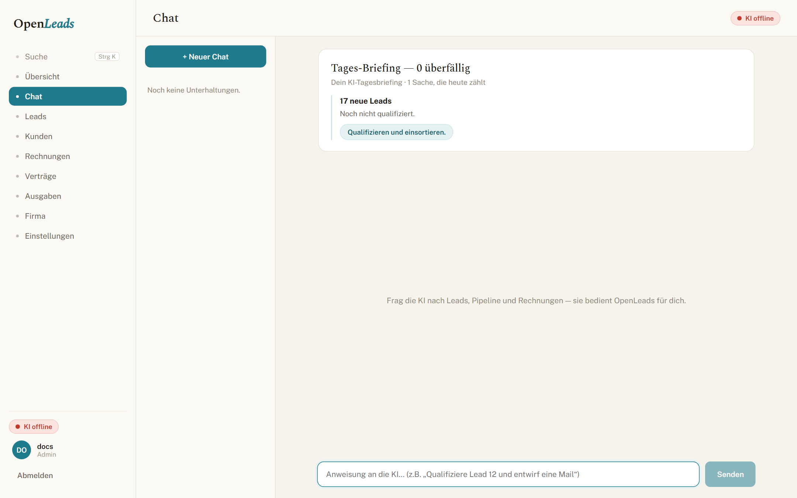
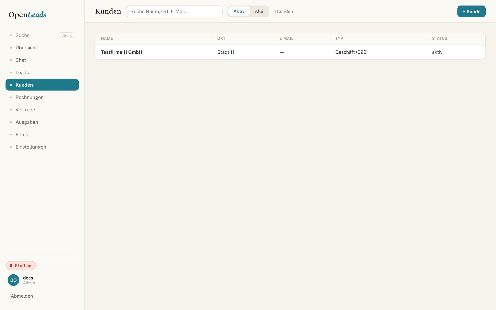
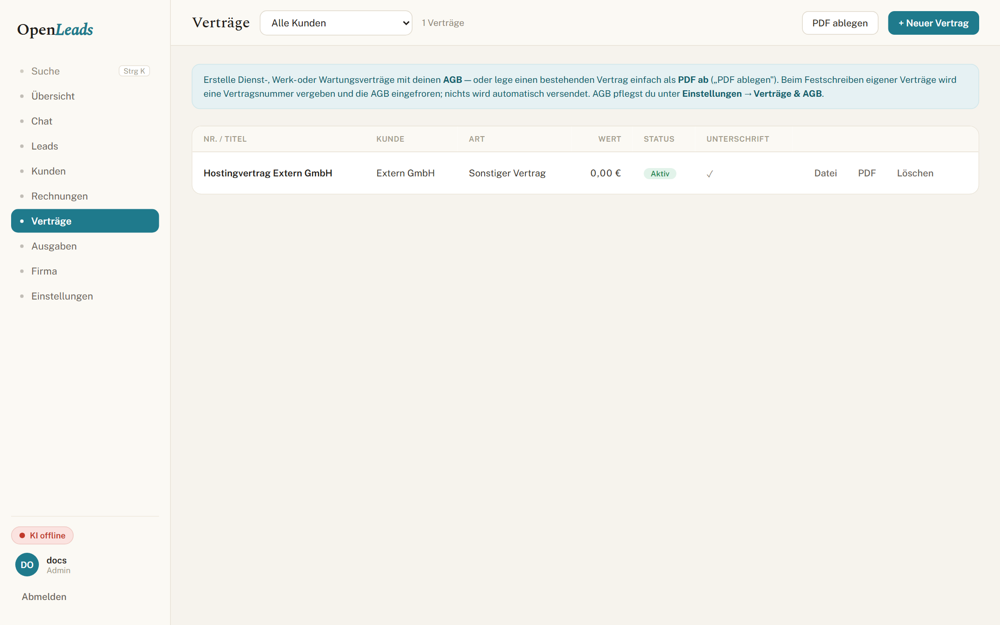
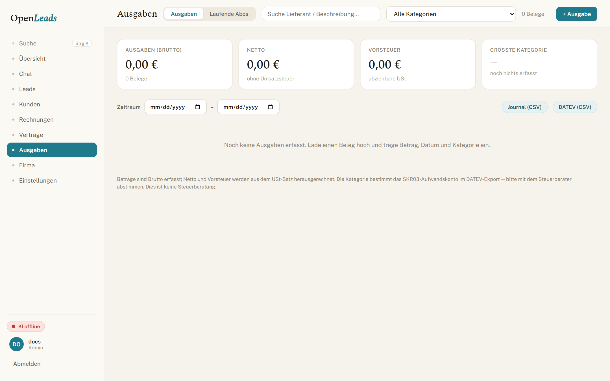
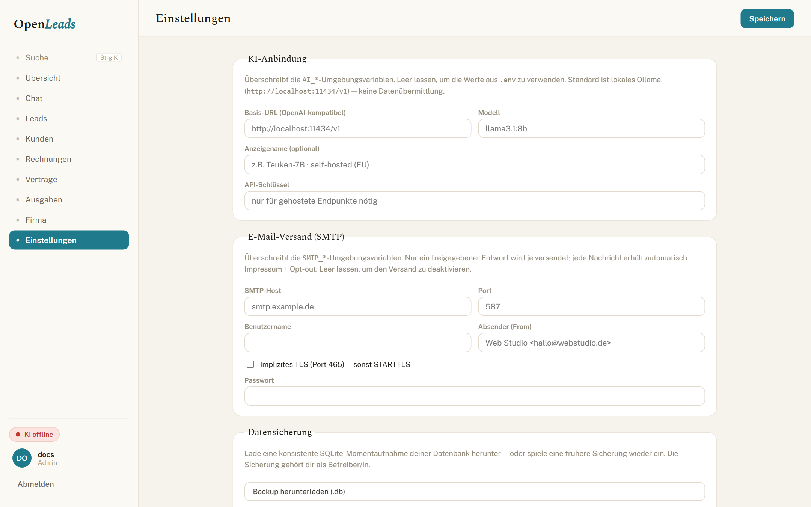

# Modules

A short tour of the sidebar. Names match the German UI.

---

## Übersicht

The home screen. Open and overdue receivables, issued revenue, net result, open leads, conversion, expenses, active contracts, and open drafts. Below that: a 12-month revenue chart, pipeline bars by stage, and contracts whose term ends in the next 60 days.

KPI cards jump into the right list with a **Zurück zu …** trail so you can return without hunting.

---

## Chat

The copilot. Same tools the UI uses — not a separate API. Typical asks:

- “Qualifiziere die neuen Leads und schlage nächste Schritte vor”
- “Erstelle ein Angebot für Müller GmbH: Website Business + Hosting”
- “Lies https://example.de und leg einen Lead an”

Outgoing mail always needs your approval. Details: [AI.md](AI.md).

---

## Leads

Pipeline as **Board** or **Tabelle**. Stages run from *Neu* through *Gewonnen* / *Verloren*. Each lead can carry website state (tech stack, mobile-friendly, staleness signal, score) — useful when you sell websites to local businesses.

Ways leads arrive:

- **+ Lead** in the toolbar
- **Import xlsx** (see [templates/](templates/))
- Chat (“look at this URL…”)

Dedupe is by domain, so re-importing the same sheet does not flood the board.

---

## Kunden

Central client registry. Open a customer for KPIs and linked Belege, Verträge, and Serien. Creating a Rechnung or Vertrag from here prefills the recipient block and keeps the link.

---

## Rechnungen

Angebote and Rechnungen in one list. Build from:

- empty draft (+ Angebot / + Rechnung)
- **Leistungskatalog** positions
- a sentence via **KI-Rechnung aus Text** (when AI is online)
- conversion from a won lead / customer

When you **Festschreiben** a Rechnung you get a ZUGFeRD / Factur-X PDF/A-3, a number from the gapless series, and a document that can no longer change content (GoBD). Corrections go through **Stornorechnung** — a linked draft with negated positions; the original flips to *storniert* only when the Storno is finalised.

Record payments (partial supported). Upload the signed/final PDF onto the record if you keep paper copies elsewhere.

**Serienrechnungen** (recurring) have no sidebar tab of their own — open them from the related **Vertrag** or **Kunde**. Each period produces a *draft* for you to review. Nothing is auto-sent.

---

## Verträge

Contracts with parties, scope, remuneration, term, and notice. Types include Dienst-, Werk-, Wartungsvertrag, Auftragsbestätigung, Rahmenvertrag, AVV, and more. On finalise:

- gapless Vertragsnummer
- **AGB snapshot frozen** into that contract
- multi-page PDF with signature block

You can e-mail for signature and later upload the countersigned copy.

Already have a signed PDF from elsewhere? Use **PDF ablegen** — file it, optional Kunde / Wert / Laufzeit, mark aktiv. No contract number is consumed; Fristende still feeds the Übersicht reminder.

---

## Ausgaben

The cost side: Belege (vendor, category, date, gross → net + Vorsteuer) and laufende Abos (your SaaS/hosting costs) with renewal hints. Categories map to SKR03. Export journal + DATEV CSV for the Steuerberater.

---

## Firma & Einstellungen

**Firma** (admin): business profile used on PDFs and in the Impressum footer of outreach.

**Einstellungen** (admin): numbering schemes, AGB text, **Leistungskatalog**, users (`admin` / `member`), AI + SMTP connections, Steuerberater exports, backup download, DSGVO tools (export / erasure / consent / Art. 30 record).

A fresh install seeds a web-agency catalog — Website Starter/Business/Premium, Relaunch, Hosting & Pflege, SEO, Google Business Profil, and so on. Edit prices under the catalog UI; invoice lines copy values at insert time so later catalog edits never rewrite history.
