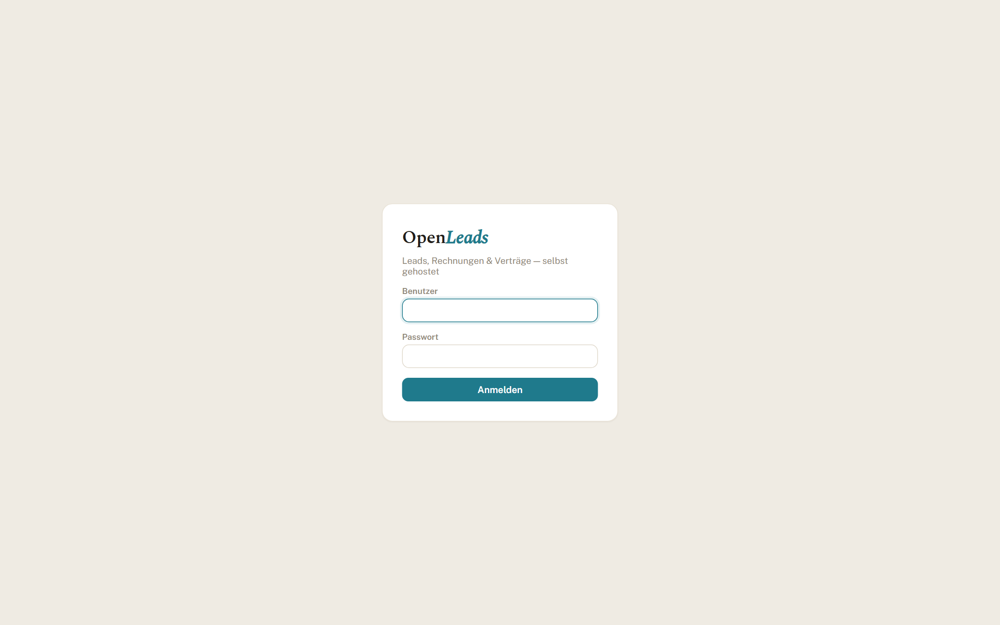

# Setup

Get a local OpenLeads instance running on your machine.

---

## Prerequisites

- **Node 22.5+** (built-in `node:sqlite`). Node 24 is a good default.
- `npm` (ships with Node)
- Optional: [Ollama](https://ollama.com) if you want the Chat copilot with a local model

Check:

```bash
node --version
```

---

## 1. API

```bash
cd api
npm install
cp .env.example .env
```

Edit `api/.env` and set a real **`SETTINGS_KEY`**:

```bash
node -e "console.log(require('crypto').randomBytes(32).toString('hex'))"
```

In development the app *can* boot without it (with a warning). In production it fails closed — you cannot save AI/SMTP credentials without a key. Generate it now and keep the same `.env` when you deploy later.

Create your login (there is no public signup):

```bash
npm run seed -- admin "your-strong-password"
```

Re-running with the same username updates the password.

Start:

```bash
npm run dev
# → http://127.0.0.1:8787
```

You will see an `ExperimentalWarning` about SQLite. That is normal.

---

## 2. Web

```bash
cd ../web
npm install
npm run dev
# → http://localhost:5173
```

Vite proxies `/api` to the API so cookies stay same-origin. No web `.env` is required in development.

Open the app and sign in with the user you seeded.



---

## 3. Local AI (optional)

Chat needs an OpenAI-compatible endpoint. Defaults target **local Ollama**:

| Variable | Default |
|----------|---------|
| `AI_BASE_URL` | `http://localhost:11434/v1` |
| `AI_MODEL` | `llama3.1:8b` |

```bash
ollama pull llama3.1:8b
```

Leave the defaults alone if Ollama is on the same machine. Prefer a hosted endpoint? Set `AI_BASE_URL`, `AI_MODEL`, and `AI_API_KEY` in `.env`, or configure them under **Einstellungen** (secrets are encrypted with `SETTINGS_KEY`).

Without AI, the rest of the suite still works — only Chat stays quiet.

---

## Authentication modes

`AUTH_MODE` chooses how users sign in:

- **`password`** (default) — the built-in login form with local accounts you seed and manage in-app. This is the standalone setup above; nothing to configure.
- **`proxy`** — delegate authentication to an **authenticating reverse proxy** in front of OpenLeads. This is how you put the app behind single sign-on (SSO/MFA) without OpenLeads implementing OAuth itself. Works with any forward-auth proxy — Authelia, Authentik, oauth2-proxy, Pomerium, Cloudflare Access, and the like.

### How proxy mode works

The proxy authenticates the user and forwards their identity as request headers. On each request OpenLeads:

1. verifies a shared secret header (so only the proxy can assert an identity),
2. reads the username (and optional groups) from configurable headers,
3. provisions the user on first sight (no signup, no password), and
4. grants the **admin** role to members of `PROXY_AUTH_ADMIN_GROUP` — or to everyone, if you leave it empty (single-operator install).

There is no OpenLeads cookie or session in this mode: the proxy owns the session and the identity is re-read every request, so group/role changes take effect immediately.

### Minimal configuration

```bash
AUTH_MODE=proxy
PROXY_AUTH_USER_HEADER=X-Forwarded-User         # what your proxy sends
PROXY_AUTH_GROUPS_HEADER=X-Forwarded-Groups
PROXY_AUTH_ADMIN_GROUP=crm-admins               # empty = every user is admin
PROXY_AUTH_SECRET_HEADER=X-Proxy-Auth-Secret
PROXY_AUTH_SHARED_SECRET=<long-random-string>   # the proxy must send this
PROXY_AUTH_LOGOUT_URL=https://sso.example.com/logout
```

Header names differ per proxy — e.g. Authentik's forward-auth outpost emits `X-authentik-username` / `X-authentik-groups`, while oauth2-proxy and Authelia emit the `X-Forwarded-*` defaults above. See `api/.env.example` for the full list.

### Security — do not skip

Trusting identity headers is safe **only if OpenLeads cannot be reached except through the proxy** — anything able to talk to the app directly could otherwise forge the headers. Two must-dos:

- Set **`PROXY_AUTH_SHARED_SECRET`** and configure the proxy to send it in `PROXY_AUTH_SECRET_HEADER`. Requests without the matching secret are rejected; without it, a warning is logged at boot.
- Bind the app to the proxy only — publish the container port on `127.0.0.1` or keep it on an internal network, never directly on the public internet.

---

## Environment reference

| Variable | Purpose |
|----------|---------|
| `SETTINGS_KEY` | AES-256-GCM key for Settings-stored credentials |
| `DB_PATH` | SQLite file (default `./data/leads.db`) |
| `WEB_ORIGIN` | Allowed origin for CORS + CSRF (`http://localhost:5173` in dev) |
| `TRUST_PROXY` | `1` only behind *your* reverse proxy |
| `AUTH_MODE` | `password` (default) or `proxy` (SSO via a reverse proxy) |
| `PROXY_AUTH_*` | Proxy/forward-auth settings (only when `AUTH_MODE=proxy`) |
| `NODE_ENV` | `development` or `production` |
| `AI_*` | Model endpoint (overridable in UI) |
| `SMTP_*` | Mail (overridable in UI; optional) |

Full comments live in `api/.env.example`.

---

## Common pitfalls

- **Node too old** → `node:sqlite` fails to load. Upgrade past 22.5.
- **Edited `.env.example` instead of `.env`** → the app only reads `.env`.
- **Treating the SQLite warning as a crash** → it isn’t.
- **Chat does nothing** → no model endpoint reachable; everything else is fine.
- **Can’t save AI/SMTP in production** → missing `SETTINGS_KEY`.

---

## Production

Don’t improvise a custom stack on day one. OpenLeads ships one Docker image and a compose file:

→ **[../deploy/DEPLOY.md](../deploy/DEPLOY.md)**

That walkthrough covers secrets, nginx + TLS, seeding the login in-container, backups, and restore.
